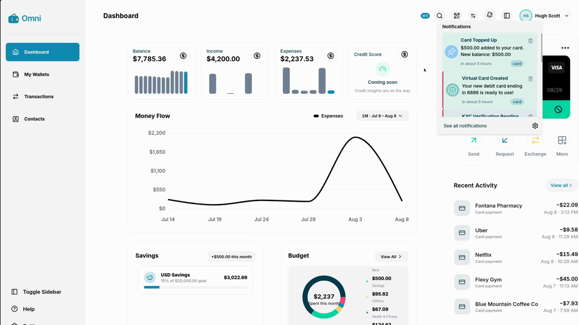

<div align="center">
  
  <h1>Omni Server</h1>
</div>

**Microservices backend for the Omni digital-payments demo.** Go services for users, wallets, transactions and fraud scoring, a FastAPI notification service with WebSocket push, Kafka for domain events, one nginx gateway in front. Pairs with [Omni-UI](https://github.com/HughScott2002/Omni-UI).

<p>
  
  
  
  
  
</p>

<div align="center">
  <a href="https://github.com/HughScott2002/Omni-Server/raw/main/docs/omni-demo.mp4">
    
  </a>
  <p><a href="https://github.com/HughScott2002/Omni-Server/raw/main/docs/omni-demo.mp4">▶ Watch the demo</a> · 52s walkthrough of the seeded stack</p>
</div>

## Quick start

```bash
make build     # build, start, and seed the full stack (uses .env.example)
```

That's the whole setup. It brings the services up, waits for the gateway, then creates a demo account with an approved KYC status, funded wallets, a virtual card, and six months of transaction history.

Log in from Omni-UI with **demo@omni.dev / DemoPass123!**

There is no default account baked into the services. That login exists only because `make build` seeded it. Storage is **in-memory by design** (`MODE=memcached`), which keeps iteration fast while the services are still taking shape, so the demo data dies with the containers. `make build` and `make restart` both reseed, so you rarely need to think about it. `make seed` seeds a stack that's already running and is safe to re-run: it detects existing demo history and leaves it alone rather than stacking a second six months onto the same balance. For a genuinely clean slate, use `make restart`. If a login ever returns `404 User doesn't exist`, the containers were recreated without a reseed, and `make seed` fixes it. A persistent database lands later; the Redis-backed `MODE=db` groundwork exists but isn't finished (#10).

Working on the services themselves rather than just running them? `nix develop` drops you into a shell with Go, Python + poetry, the linters, and `redis-cli`/`kcat` already on `PATH`.

## Architecture

```text
Omni-UI ──> nginx (:80) ──┬─> /api/users          user-service        :8081  Go
                          ├─> /api/wallets        wallet-service      :8082  Go
                          ├─> /api/notifications  notification-service:8083  FastAPI + WS
                          ├─> /api/transactions   transaction-service :8084  Go
                          └─> /api/fraud-detection fraud-detection    :8085  Go

Kafka: account-created · kyc-approved · contact-* · virtual-card-* · account-deletion
       (wallet bootstrap + activation, notifications fan out over WebSocket)
```

**Register** → user-service emits `account-created` → wallet-service creates a wallet + virtual card (inactive until verified). **Verify** → consent-gated KYC submit approves the account → `kyc-approved` activates wallets and cards. **Transfer** → transaction-service checks sender/receiver, calls wallet + fraud scoring, records history.

## Commands

| Command | What it does |
| --- | --- |
| `make build` | Build, start, and seed the stack |
| `make seed` | Seed a running stack (no-op if already seeded) |
| `make down` / `make restart` | Stop / rebuild (`restart` reseeds) |
| `make logs` / `make ps` | Follow logs / list services |
| `make test` | Smoke-check the running stack |
| `make swarm-*` | Local Docker Swarm variant |

## Status

Works today: auth + sessions, contacts/OmniTag, consent-gated KYC with wallet activation, virtual cards, transfers + card purchases with rules-based fraud scoring, transaction history, real-time notifications, dev seeding endpoints (local-only).

Known gaps (tracked in issues): persistent storage (#10), auth enforcement across services (#12, #17), real verification pipeline (#16), health endpoints + chaos targets (#11), tests + CI beyond user-service (#6).

The bounded portfolio finish line, release blockers, non-goals, and proof-of-done are in [`PORTFOLIO_SCOPE.md`](PORTFOLIO_SCOPE.md). Until that checklist passes, treat the repository as a local experimental demo rather than a completed banking system.

## Docs

[`PORTFOLIO_SCOPE.md`](PORTFOLIO_SCOPE.md) · [`4-transactions/TRANSACTIONS_API.md`](4-transactions/TRANSACTIONS_API.md) · [`3-wallet/WALLET_API.md`](3-wallet/WALLET_API.md) · [`5-fraud-detection/FRAUD_DETECTION_RULES.md`](5-fraud-detection/FRAUD_DETECTION_RULES.md) · [`docker-swarm/README.md`](docker-swarm/README.md)

## License

See [`LICENSE`](LICENSE).
